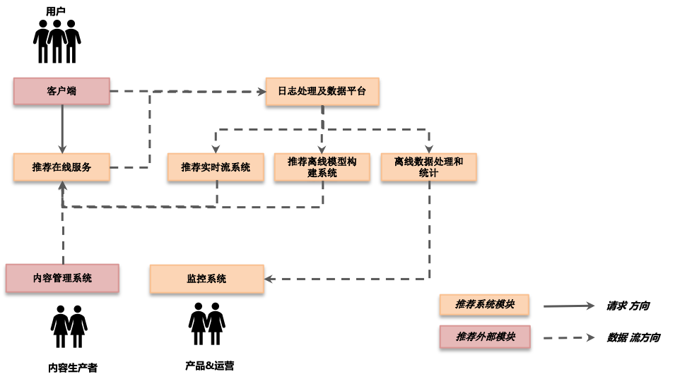

# 推荐系统概述

## 推荐系统框架

一个完整的推荐系统大致包含4个部分

- 在线服务系统
  - 响应客户端实时请求, 返回被推荐的内容列表
  - 在线服务一般需为用户的每次请求从海量内容候选中选出当前状态用户最可能感兴趣的内容列表
  - 在线系统要有处理高并发能力,对响应时间也有比较高的要求, 性能好坏决定用户体验的好坏
- 日志处理及数据平台
  - 模型数据来源于日志, 监控数据也来源于日志, 日志是推荐系统乃至整个应用的重要信息来源, 一个好的系统日志必不可少
  - 数据平台, 用于处理海量日志和数据的工具平台, 属于推荐系统的重要基础架构
- 离线系统
  - 负责数据处理统计监控
  - 离线模型更新
- 实时流处理系统
  - 批训练模型更新
  - 用户实时行为反馈的关键途径, 用户行为是否实时反馈, 对推荐效果也有着至关重要的影响
  - 实时的监控

推荐系统也需要和外部进行交互

- 客户端, 请求来源, 结果展示
- 内容管理系统, 推荐的内容来自内容管理系统的数据库, 一般由用户上传或者专业内容生产者通过内容管理系统提供

在接下来的章节中, 将从日志定义开始, 逐个模块分析推荐系统内部的运作原理
